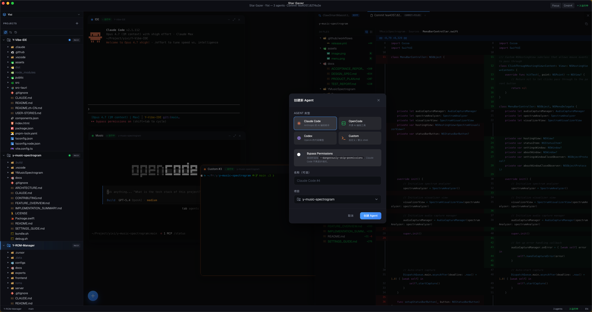

<div align="center">

# Star Gazer ✨

**A Mac-native, ultra-light workbench for commanding many AI coding agents in parallel.**

[](./LICENSE)
[]()
[]()
[](./README.zh-CN.md)

Put terminals and agents center stage. Summon files and diffs only when you need them.

Built for developers who let AI agents do 70% of the coding — and who run three of them at once.

[Download the latest builds](https://github.com/Yixi/Star-Gazer/releases) · [阅读中文文档](./README.zh-CN.md)



</div>

## 📖 What is Star Gazer?

Star Gazer is a **Mac-native development workbench** designed from the ground up for the vibe-coding era.

Traditional IDEs are laid out for one person typing code — editor in the center, terminal squeezed into a small bottom panel. Star Gazer flips that around: **terminals and agents take the stage**, while files and diffs live in an on-demand side panel.

It is built for workflows like:

- Running three `Claude Code` / `OpenCode` / `Codex` sessions side by side, each on a different git worktree
- Orchestrating agents across several repos at once — front-end, back-end, shared libs — without ever `cd`ing
- Dropping a single **parent folder** into the sidebar and having every nested repo auto-discovered as its own project
- Letting an agent refactor while you review the files it has already touched

## ✨ Highlights

- **🎭 Agent-first canvas**: An infinite 2D canvas where every card is an agent terminal — not yet another file tab.
- **🗂️ Multi-repo & parent-folder workspaces**: Add multiple projects, or point at a single parent directory and let Star Gazer auto-discover every git repo underneath. Each project keeps its own file tree, branch, agent sessions and color identity.
- **🌈 Git-fused file tree**: Changed lines (`+X -Y`), new / deleted / untracked / conflict states and per-agent color tags render right inside the tree — per repo.
- **👁️ Hover-to-see-who-did-what**: Hover an agent card and the sidebar instantly highlights every file that agent touched, while dimming the rest — no clicks required.
- **💓 Live-write pulse**: Files being written by an agent right now glow with a 1.4s pulsing blue dot, so you can *see* agents working.
- **🪟 Slide-in review panel**: A floating 800px panel for diffs, file viewing and Markdown preview — drag to resize, Esc to dismiss, never steals canvas space.
- **🍎 Built like a Mac app**: Tauri 2 + WKWebView — under 25MB binary, under 150MB idle RAM, cold start below 1.2s.
- **⌨️ Keyboard-first**: `Cmd+K` command palette, `Cmd+N` new agent, `Cmd+B` collapse sidebar, `Cmd+\` toggle panel.
- **🎨 Linear-grade polish**: Hand-tuned dark theme, 60fps drag, GPU-accelerated transitions.

## 💡 Why Star Gazer?

Star Gazer is built around one observation: **as AI writes more code, the developer's job shifts from typing to reviewing and directing**. The UI should follow.

| Pain Point (Traditional IDE) | The Star Gazer Workbench |
| :--- | :--- |
| **Terminal is a second-class citizen** squeezed into a bottom panel. | **Terminal is the stage**. Each agent gets its own card on an infinite canvas. |
| **LSP, debugger, plugins, git GUI, merge tools** bundled in — 500MB RAM baseline. | **Bold subtraction**. No LSP, no debugger, no plugins. The agent handles them. |
| **"Which agent changed what?"** buried in diff panels across tabs. | **One hover tells you.** Agent colors bleed into the file tree in real time. |
| **Cross-platform bloat**: Electron + Chromium everywhere. | **Mac-only, WKWebView-based.** Native feel, tiny footprint. |

## 🚀 Getting Started

*Star Gazer is currently in Alpha. Expect rough edges, and expect us to move fast.*

### Download

Prebuilt `.dmg` builds will be published on the [GitHub Releases](https://github.com/Yixi/Star-Gazer/releases) page.

Current builds are **ad-hoc signed** but **not notarized**. On first launch macOS will refuse to open the app; open it once from **System Settings → Privacy & Security**, scroll to the `"Star Gazer" was blocked` notice and click **Open Anyway**. You only need to do this once.

### Building from Source

#### Prerequisites

- macOS 14 (Sonoma) or newer
- Node.js `>= 20`
- pnpm `>= 10`
- Rust toolchain (`rustup` + stable)
- Xcode Command Line Tools
- (Recommended) `claude`, `opencode`, or `codex` installed globally so agent cards can launch them.

#### Build Instructions

```bash
# 1. Clone the repository
git clone git@github.com:Yixi/Star-Gazer.git
cd Star-Gazer

# 2. Install dependencies
pnpm install

# 3. Start the dev environment
pnpm tauri:dev

# 4. Build a release .dmg
pnpm tauri:build
```

## 🏗️ Technical Architecture

Star Gazer keeps the stack deliberately lean:

- **Shell**: Tauri 2.x — system WKWebView, no bundled Chromium
- **Frontend**: React 19 + TypeScript (strict) + Vite 7
- **Styling**: Tailwind CSS 4 (CSS-based config) + shadcn/ui + Base UI
- **State**: Zustand
- **Terminal**: `xterm.js` + WebGL renderer, backed by Rust `portable-pty`
- **Editor**: CodeMirror 6 (lighter than Monaco)
- **Diff**: `react-diff-view` + `unidiff`
- **File tree**: `react-arborist` (virtual scrolling)
- **Command palette**: `cmdk`
- **Backend**: Rust (Tokio) — PTY manager, file watcher via `notify`, and a `GitService` that shells out to the system `git` CLI (same approach as VSCode — no libgit2).

## 🧭 Design Principles

1. **Terminal-First** — terminals and agents are the protagonists; files and diffs are supporting cast.
2. **Peek, Don't Browse** — glance to know the state, not click through panels.
3. **One Thing Per Card** — each canvas card does one job.
4. **Invisible Until Needed** — auxiliary UI (panels, menus, HUDs) hides until summoned.
5. **Respect the User's Layout** — cards the user placed are never auto-rearranged.
6. **Fast Is a Feature** — performance is a hard constraint, not an optimization pass.

### Explicit non-goals

Star Gazer will **not** grow into these, by design:

- ❌ LSP, completion, go-to-definition, refactoring tools — the agents do them
- ❌ Debugger — use native tools in the terminal
- ❌ Plugin system, cross-platform support, collaboration features
- ❌ Git GUI for commit / push / pull, merge-conflict resolvers

Saying no is how we stay small.

## 🤝 Contributing

Star Gazer is open source and still shaping its shape. Issues, discussions and PRs are all welcome — especially ones about the reviewing-multiple-agents workflow that the product is built around.

## 📄 License

[MIT](./LICENSE)

---

<div align="center">

<p>Made for the vibe-coding era.<br>Built with ❤️ on a Mac, for Mac.</p>

[](./LICENSE)

</div>
